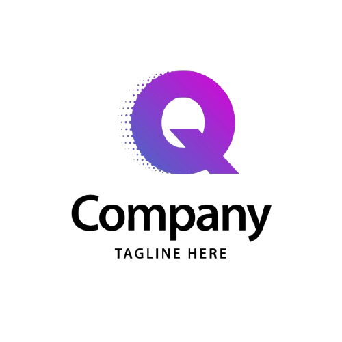

[](https://github.com/Ozziekins/quizz_app/actions)
[](https://github.com/Ozziekins/quizz_app/actions)
[](https://github.com/Ozziekins/quizz_app/actions)


<br />

<p align="center">
  
</p>

<h1 align="center">Quizz App – Triple Frontend Frameworks</h1>

<p align="center">
  By Ozioma Okonicha
  <br />
  <a href="https://github.com/Ozziekins/quizz_app"><strong>Explore the repo »</strong></a>
  <br />
  <br />
  <a href="https://github.com/Ozziekins/quizz_app/issues">Report Bug</a>
  ·
  <a href="https://github.com/Ozziekins/quizz_app/pulls">Request Feature</a>
</p>

<details open="open">
  <summary>Table of Contents</summary>
  <ol>
    <li>
      <a href="#📚-project-overview">Project Overview</a>
      <ul>
        <li><a href="#⚙️-tech-stack">Tech Stack</a></li>
      </ul>
    </li>
    <li>
      <a href="#🛠-getting-started">Getting Started</a>
      <ul>
        <li><a href="#prerequisites">Prerequisites</a></li>
        <li><a href="#scripts">Scripts</a></li>
      </ul>
    </li>
    <li><a href="#🧪-testing">Testing</a></li>
    <li><a href="#⚙️-pipeline-github-actions">GitHub Actions</a></li>
    <li><a href="#📬-contacts">Contacts</a></li>
  </ol>
</details>

---

## 📚 Project Overview

The **Quizz App** is a trivia-based quiz platform implemented using **three different frameworks** — React, Next.js and SolidJS. Users can take random quizzes or select from themed categories. Built as a demo to showcase full-stack frontend development, testing, and deployment practices.

---

### ⚙️ Tech Stack

#### Common
- OpenTDB API
- CSS Modules
- Playwright for E2E testing
- Vitest for unit testing
- Biome for linting and formatting

#### React App
- React 18
- Vite
- React Router v6
- JavaScript + JSDoc

#### Next App
- Next.js 15 (App Router)
- TypeScript
- File-based routing

#### Solid App
- SolidJS + SolidStart
- Vinxi for SSR routing
- Per-question hint logic with reactivity
- TypeScript only

---

## 🛠 Getting Started

### Prerequisites

- Node.js >= 18
- npm

Clone the repo:
```bash
git clone https://github.com/Ozziekins/quizz_app.git
cd quizz_app
```

### Scripts (root-level)

```bash
npm run lint         # Biome lint all projects
npm run lint:fix     # Auto-fix lint issues
npm run format       # Format codebase
npm run typecheck    # Type check Next.js project
npm run test         # Run unit tests (both apps)
npm run e2e:react    # Run Playwright E2E for React app
npm run e2e:next     # Run Playwright E2E for Next app
npm run e2e:solid    # Run Playwright E2E for Solid app
```

---

## 🧪 Testing

Each app has unit tests for at least one interactive component or API fetch.

### Unit Test Highlights
- **React**: test homepage and category interactions
- **Next**: test dynamic quiz fetch and navigation

### E2E Test
Single Playwright setup runs against all apps:
- Navigates to home
- Simulates user click
- Asserts DOM updates before & after API interaction

---

## ⚙️ Pipeline (GitHub Actions)

On every push or PR to `main`, GitHub Actions will:

- Run Biome for **linting**, **formatting**
- Typecheck the Next app
- Run **unit** and **E2E** tests
- Deploy all apps to Vercel if all checks pass

---

## 📬 Contacts

- [o.okonicha@innopolis.university](mailto:o.okonicha@innopolis.university)

---

_This project was built for the React Frameworks Course in Harbour Space Spring Semester of 2025._

